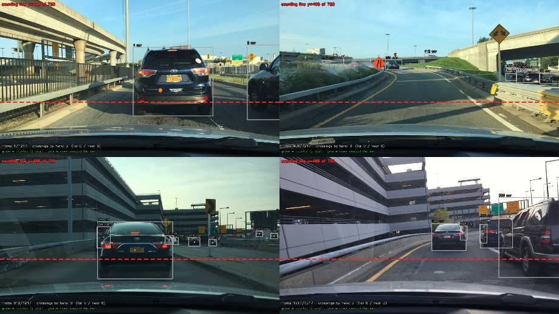
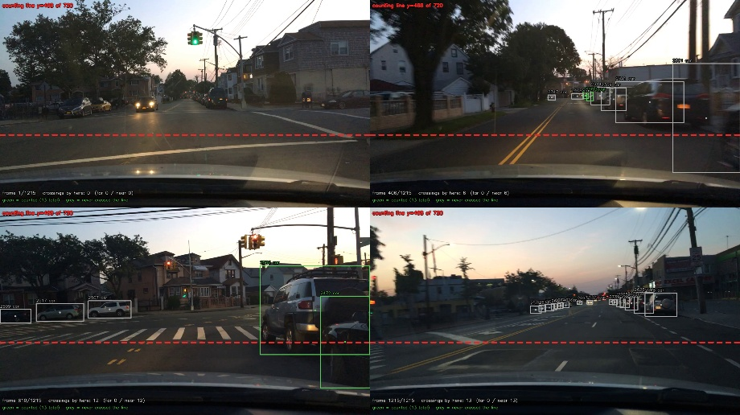
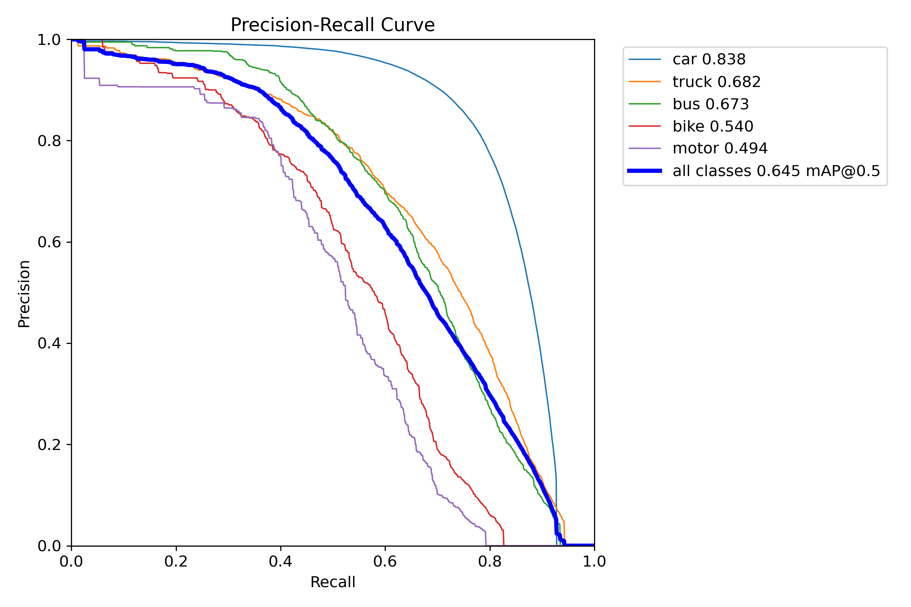
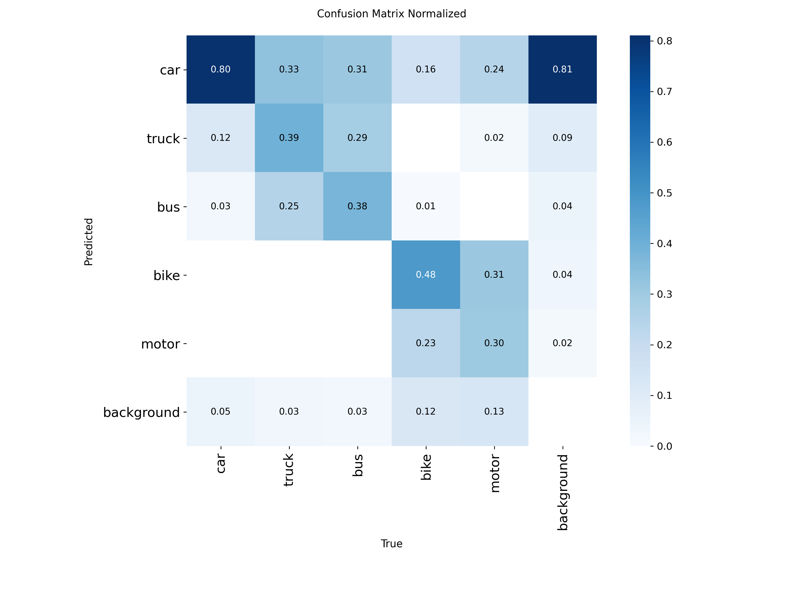
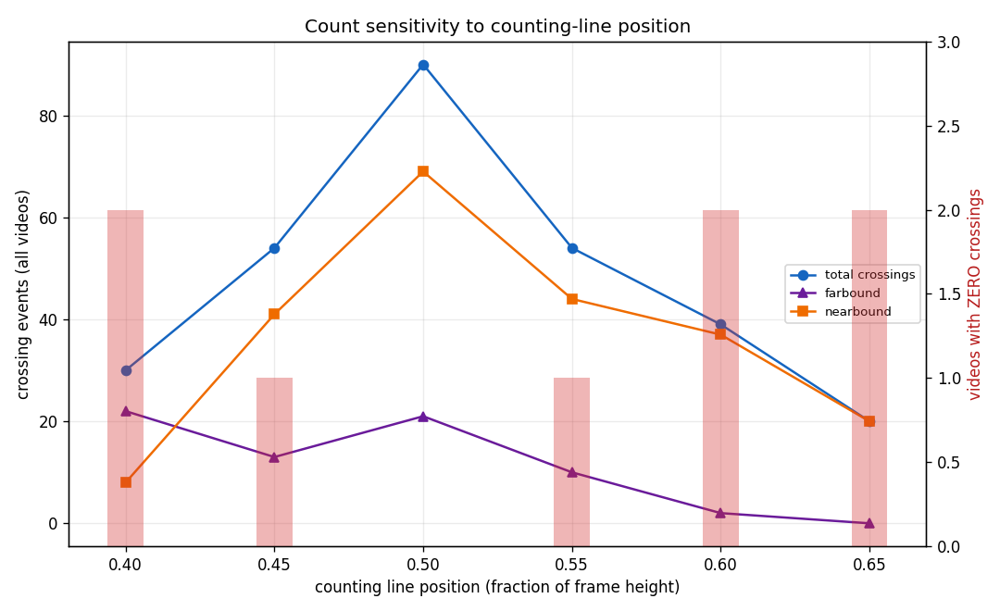
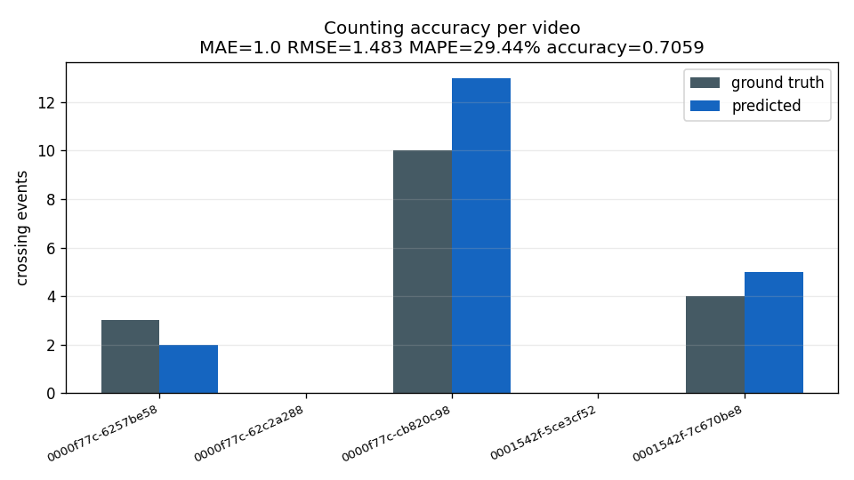
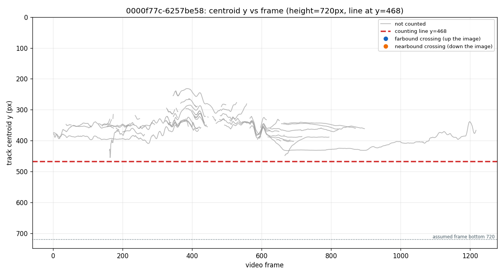

# traffic_ai

Vehicle detection, multi-object tracking and traffic counting on
[BDD100K](https://bdd-data.berkeley.edu/), built as a reproducible research
pipeline: **inspection → dataset prep → validation → training → evaluation →
tracking → counting**, with every stage emitting a JSON report and a set of
integrity checks that fail loudly rather than producing plausible-looking wrong
numbers.

Everything runs on Kaggle (Tesla T4). **No model weights or BDD100K data are
committed here** — you train it yourself in one stage.

**Read this before trusting a number.** Two of the three headline comparisons
rest on **five 40-second clips**, and the daytime stratum is a *single*
city-street clip while both highway clips are night/dawn-dusk. With n = 1/2/2,
illumination cannot be separated from scene type — by scene, highway is the
weakest stratum (MOTA 0.308) regardless of light. And **54 crossings is not a
traffic volume**: counts swing 54 / 90 / 54 / 39 / 20 across the swept line
positions, so only the *agreement with ground truth* is robust, not the absolute
count. See [Known limitations](#limitations).

## Contents

- [Results at a glance](#results-at-a-glance)
- [The interesting finding](#the-interesting-finding-what-the-night-false-positives-actually-are)
- [Pipeline](#pipeline)
- [Setup](#setup)
- [Design decisions worth knowing about](#design-decisions-worth-knowing-about)
- [Limitations](#limitations)
- [Tests](#tests)
- [Data and licences](#data-and-licences)
- [Author](#author)

---

## Results at a glance

Detector (YOLOv8s, 960 px, fine-tuned on 70k BDD100K frames):

| metric | value |
|---|---|
| mAP@50 | **0.645** |
| mAP@50-95 | **0.413** |
| precision / recall | 0.722 / 0.576 |

Per class AP@50: car **0.838** · truck 0.682 · bus 0.673 · bike 0.541 · motor 0.494

Multi-object tracking (BoT-SORT, 5 clips vs BDD100K box-track GT):

| stratum | n | MOTA (pooled) | MOTP | IDF1 |
|---|---|---|---|---|
| daytime | 1 | **0.768** | 0.868 | 0.751 |
| night | 2 | **0.485** | 0.813 | 0.737 |
| dawn/dusk | 2 | **0.406** | 0.797 | 0.690 |

Vehicle counting (virtual line, chosen from data, 5 clips):

| metric | value |
|---|---|
| crossings predicted / ground truth | 54 / 51 |
| MAE · RMSE · MAPE | **1.80** · 2.49 · **24.0%** |
| counting accuracy | **0.824** |

### Annotated frames — what a count actually looks like

Green box = track that crossed the line, grey = never crossed, red line = the
counting line, running per-direction tally top-left. Montage of four real frames.





### Detection performance





### The counting line was measured, not guessed





### Trajectories explain every count

Centroid *y* per frame for every track, with the line drawn and each crossing
marked blue (farbound) / orange (nearbound). This is the view that shows *why* a
clip counted zero — an aggregate bar chart cannot.



---

## The interesting finding: what the night false positives actually are

Tracking at night looked much worse than by day (FP 94 in daylight vs ~700 per
clip at night), while **false negatives stayed flat**. That pattern has two
incompatible explanations: a detector hallucinating in the dark, or a correct
detector being unfairly scored against a ground truth that is 6× downsampled.
They call for opposite fixes, so the project measures which one it is
(`06_track.py --fp-audit`).

Every one of the 2010 false positives is classified by *how* it missed:

| band | count | share | meaning |
|---|---|---|---|
| `localisation` | 711 | 35% | detector found the object, box is sub-threshold (0 < IoU < 0.5) |
| `gt_sampling` | 19 | **1%** | the object *is* annotated in a neighbouring keyframe |
| `unexplained` | 1280 | 64% | no GT overlap within ±1 annotated sample |

**The convenient excuse fails.** Only 1% of false positives are explained by the
sparse ground truth, so the night gap is not a measurement artifact — the
objects genuinely are absent from the annotations at those positions.

**But they are not phantom vehicles.** Cross-tabulating with box area is
decisive:

| clip | stratum | FP | unexplained | **tiny (<32×32 px)** | medium | large |
|---|---|---|---|---|---|---|
| 6257be58 | daytime / city | 94 | 24 | 49 | 3 | 0 |
| 62c2a288 | dawn/dusk / highway | 703 | 549 | **699** | 0 | 0 |
| cb820c98 | dawn/dusk / residential | 381 | 197 | 295 | 9 | 1 |
| 5ce3cf52 | night / city | 712 | 475 | **679** | 1 | 0 |
| 7c670be8 | night / highway | 120 | 35 | 90 | 3 | 2 |

699 of 703 and 679 of 712 false positives are **smaller than 32×32 pixels** —
under 0.2% of a 1280×720 frame. The medium and large bands are essentially
empty. So the detector is not inventing vehicles in the dark; it is firing on
distant tail-lights, headlight speckle and dark-texture blobs near the horizon.

That is a **small-object problem, not a night-enhancement problem** — which
matters, because the obvious next move (CycleGAN-style night enhancement) would
be chasing the wrong failure. The indicated fixes are a minimum-area filter on
detections, tiled inference, or small-object retraining.

---

## Pipeline

```
01 inspection   verify dataset structure, schema and counts   (no writes)
02 preparation  BDD100K JSON -> YOLO labels + image symlinks   (full accounting)
03 validation   independent PASS/FAIL checks on the output
04 training     fine-tune a pretrained YOLO detector
05 evaluation   mAP, per-class AP, day/night stratified
06 tracking     BoT-SORT / ByteTrack + CLEAR MOT metrics + FP forensics
07 counting     virtual-line crossings, direction- and class-aware
```

```
traffic_ai/
├── src/
│   ├── config.py      single source of truth: paths, class taxonomy, GT_LABEL_MAP
│   ├── track.py       MOT accumulation, GT loading, CLEAR metrics, FP forensics
│   ├── count.py       MOT parsing, crossing detection, flow statistics
│   ├── strata.py      BDD100K scene metadata + per-stratum aggregation
│   ├── log.py         logging + the Report builder that carries integrity checks
│   ├── viz.py         training curves
│   ├── viz_count.py   annotated frames, crossing timelines, line sweep, strata
│   └── dataset/convert.py   BDD100K → YOLO conversion (pure, unit-tested)
├── scripts/           01..07, each writes reports/phaseN_*.json
├── tests/             243 tests, none require the dataset
├── kaggle/            showcase notebook + the cell that packages a run's results
├── results/           committed metrics, plots and annotated frames
├── assets/            the figures used by this README
└── .github/workflows/ CI: the suite on Python 3.10 and 3.12
```

## Setup

```bash
pip install -r requirements.txt
python -m pytest tests/ -q          # 243 tests, ~12 s, no dataset needed
```

On Kaggle, attach the datasets, then run the stages in order:

```bash
!pip install -q ultralytics lap

# 1) rebuild the prepared dataset (symlinks do not survive a Kaggle output zip)
!python traffic_ai/scripts/02_prepare_vehicle_dataset.py
!python traffic_ai/scripts/03_validate_dataset.py

# 2) train (the only GPU-heavy stage)
!python traffic_ai/scripts/04_train.py --name baseline_s960 --imgsz 960

# 3) evaluate, including the day/night split
!python traffic_ai/scripts/05_evaluate.py \
  --model traffic_ai/experiments/<exp>/train/weights/best.pt --imgsz 960

# 4) track, with false-positive forensics
!python traffic_ai/scripts/06_track.py \
  --model traffic_ai/experiments/<exp>/train/weights/best.pt \
  --videos /kaggle/input/datasets/robikscube/driving-video-with-object-tracking \
  --gt    /kaggle/input/datasets/robikscube/driving-video-with-object-tracking \
  --max-videos 5 --fp-audit

# 5) count, placing the line from the sweep rather than by hand
!python traffic_ai/scripts/07_count.py --line-y 0.55 --fps 30 \
  --videos /kaggle/input/datasets/robikscube/driving-video-with-object-tracking \
  --gt    /kaggle/input/datasets/robikscube/driving-video-with-object-tracking \
  --sweep 0.45,0.5,0.55,0.6,0.65 --select-line gt-mae --min-gt-coverage 0.5
```

**Phase 7 must follow Phase 6 in the same session** — it reads Phase 6's
MOT files and its GT→video frame map. Phase 7 needs no GPU and re-runs in
under a minute, so sweep as many line positions as you like for free.

## Design decisions worth knowing about

- **Classes are BDD100K's own names** — `bike` and `motor`, not
  `bicycle`/`motorcycle`. An earlier config used the wrong names and silently
  dropped two classes.
- **The box-track GT is 6× downsampled** (~5 Hz labels on 30 fps video), so MOT
  metrics are computed only on annotated frames. Scoring all 1217 frames against
  ~1 Hz labels turned every detection on an unannotated frame into a false
  positive and produced MOTA ≈ −6.8. The GT→video frame map is *searched*
  (alpha × offset), with the integer stride always a candidate so it can never
  score worse than the integer stride.
- **The counting line is selected by agreement with ground truth, constrained
  to positions that see at least half the traffic** (`--select-line gt-mae
  --min-gt-coverage 0.5`). Minimising error alone is degenerate: it picks a line
  where little traffic passes, so both prediction and truth are small and the
  error is trivially small.
- **A track counts only if its first and last centroids are on opposite sides of
  the line.** Most tracks in dashcam footage hover near a line rather than
  crossing it, and counting hoverers makes the total swing ~40× across line
  positions. The rule is exactly symmetric, so it cannot favour either direction.
- **A net-displacement filter was measured and rejected**: at 5% of frame height
  it removed 93% of farbound crossings but only 56% of nearbound, because
  receding vehicles produce short tracks. Systematically under-counting one
  direction is worse than a noisier count. It survives only as an off-by-default
  experimental flag, documented with its measurement.
- **Strata come from the dataset, never from eyeballing.** A hand-written scene
  list for the five clips disagreed with the BDD100K metadata on three of five
  (one "night highway" clip is recorded `dawn/dusk` + `residential`). Labels are
  read from the Phase 2 manifests and joined by video id, and the real values are
  pinned by unit tests.

## Limitations

These are real and are stated rather than buried:

1. **Tracking metrics use a simplified CLEAR implementation** (greedy per-frame
   IoU with pair-continuity preference), not `py-motmetrics`. MOTP and MOTA are
   the meaningful numbers; upgrade before citing.
2. **IDF1 is not comparable to MOTChallenge.** With 16.6% frame coverage it
   scores re-identification across ~1 s gaps, which motion-only trackers
   structurally cannot do.
3. **The counting line was selected on the evaluation GT**, so the counting
   accuracy is optimistic. One parameter over five clips keeps the bias mild, but
   it is not zero.
4. **The absolute crossing count is line-sensitive** — 54 / 90 / 54 / 39 / 20
   across the swept positions, a 4.5× spread, and the
   `count_not_line_sensitive` check fails. The *agreement with GT* is robust
   (MAE 1.8–2.0 across eligible positions); the *volume* is not identifiable
   from a single line. Identifying a true flow rate needs multi-line or zone
   counting.
5. **Five 40-second clips is a small sample**, and the daytime stratum is a
   single city-street clip while both highway clips are night/dawn-dusk. With
   n = 1/2/2, illumination cannot be separated from scene type. The 10k-image
   validation split is the statistically meaningful comparison.
6. **Direction is screen-relative only.** BDD100K dashcam frames are not
   calibrated, so no geographic direction (northbound/inbound) and no lane
   identity is claimed. No speed is reported, because that would require
   calibration this project does not have.
7. Day/night **detection** metrics are not yet in `results/` — the
   `05_evaluate.py` stratified run has not been re-executed since the feature
   landed.

## Tests

```bash
python -m pytest tests/ -q
```

243 tests, none requiring the dataset. They cover class mapping, bbox
validation and YOLO conversion, annotation-accounting invariants, GT parquet
schema variants, null/degenerate box skipping, GT frame-map search, CLEAR
matching, IDF1 one-to-one ID matching, MOT parsing, crossing detection in both
directions, once-per-track deduplication, the false-positive audit bands, the
stratification join, and per-stratum accuracy — plus the real BDD100K
time-of-day labels of the five evaluation clips, read from the actual manifest.

Several tests exist specifically to pin bugs that produced *plausible but wrong*
numbers during development: a frame-misaligned GT comparison, a stale loop
variable that gave every video the same sweep table, a `KeyError` that would
have discarded a completed GPU run at the last step, and a duplicate function
definition that silently swallowed edits.

## Data and licences

This repository contains code and derived metrics only. It does **not**
redistribute BDD100K images, videos, labels, or the trained checkpoint.

- BDD100K — Berkeley DeepDrive, [CC BY-NC-SA 4.0](https://bdd-data.berkeley.edu/)
  (non-commercial; check the terms before any commercial use)
- YOLOv8 pre-trained weights — Ultralytics, AGPL-3.0
- This project's own code — MIT (see [LICENSE](LICENSE))

## Acknowledgements

BDD100K (Yu et al., *BDD100K: A Diverse Driving Dataset for Heterogeneous
Multitask Learning*, CVPR 2020) for the imagery and annotations; BoT-SORT
(Aharon et al., 2021) and ByteTrack (Zhang et al., 2022) for the trackers, both
used through Ultralytics; Bernardin & Stiefelhagen for CLEAR MOT.

## Author

**Pedram Nikfarjam** — Civil Engineering + AI

The sibling project [Shm-Vision](https://github.com/PedramNikfajam/Shm-Vision)
applies the same discipline to structural crack inspection: measure the failure
mode instead of assuming it, and report what the evidence does not support.

## License

MIT License — Civil Engineering Research. See [LICENSE](LICENSE).

BDD100K is CC BY-NC-SA 4.0 (non-commercial) and is **not** redistributed here.
Ultralytics, called as a library, is AGPL-3.0.
